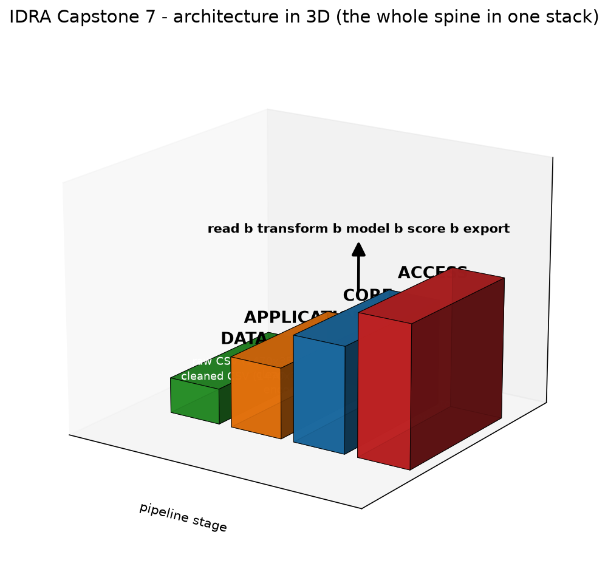
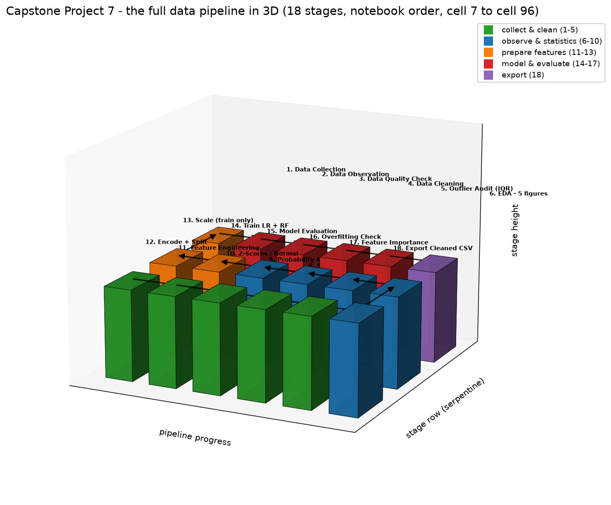
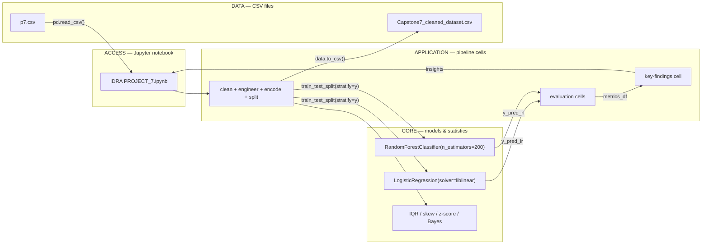
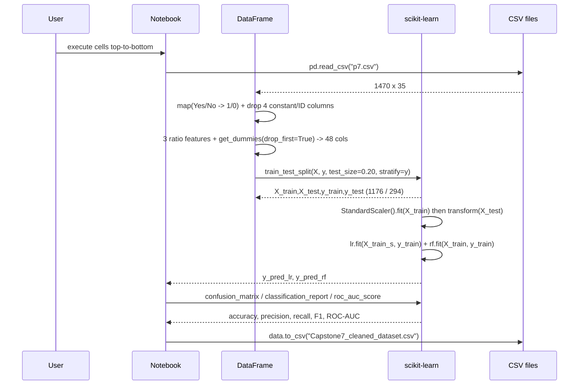
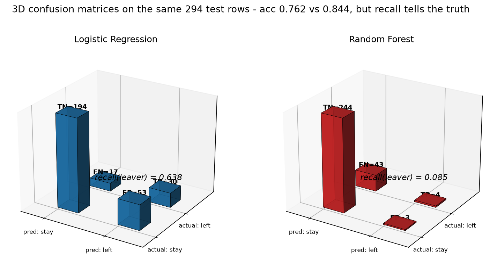
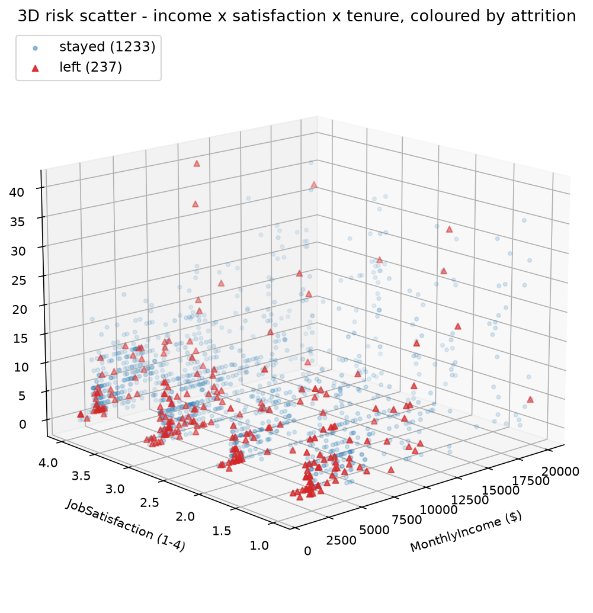

# IDRA Capstone Project 7 — Employee Attrition & Workforce Analytics

> **Know which employee is likely to leave next — from salary, overtime and satisfaction patterns that already sit in the HR system.**

A research-article style capstone for the **India Data Research Academy (IDRA) Data Science & AI Training Program**. The project reads an HR snapshot of **1,470 employees × 35 columns**, cleans it, proves the drivers of turnover with statistics and charts, then trains **two classifiers** to flag likely leavers. The analysis is delivered as an executable Jupyter notebook, not a one-shot script.

```
   INPUT                 TRANSFORM                     CORE                        OUTPUT
+-----------------+   +------------------------+   +--------------------------+   +---------------------+
| raw HR CSV      |   | clean -> 3 ratio feats  |   | LogisticRegression       |   | metrics table(recall|
| Capstone7_IBM_  |-->| encode (get_dummies)   |-->| + RandomForest(200 trees)|-->| ROC-AUC),6 findings,|
| HR_Attrition... |   | stratified 80/20 split  |   | + IQR / skew / z / Bayes |   | cleaned CSV export  |
| 1470 x 35       |   | scale (train only)      |   |                          |   | 1470 x 34           |
+-----------------+   +------------------------+   +--------------------------+   +---------------------+
```

**So what:** HR cannot interview 1,470 people. The model narrows the list to the ~16% most probable leavers, and the insights show *why* (overtime, low income + overtime, job role) — so retention budget is spent on the right people.

---

## 1. Overview

**Project spine:** `read CSV → clean → engineer ratios → one-hot encode → stratified split → scale → train 2 models → predict → evaluate → export cleaned CSV`.

| Question | Answer |
|---|---|
| Prediction task | Classification, binary target `Attrition` (1 = left, 0 = stayed) |
| Dataset | `p7.csv` — 1,470 rows, 35 cols (IBM HR Analytics dataset, provided in IDRA LMS) |
| Models | `LogisticRegression` (linear baseline) + `RandomForestClassifier` (tree ensemble) |
| Best model | **Logistic Regression** — test acc 76.2%, ROC-AUC **0.805**, recall(leaver) **0.638** |
| Why LR wins | Random Forest hits 100% train / 84.4% test (gap 15.65% → overfit) and catches only **4 of 47** real leavers (recall 0.085) |
| Distribution | 1,233 stayed / 237 left (16.1% leavers → imbalanced) |
| Deliverables | `IDRA PROJECT_7.ipynb`, `Capstone7_cleaned_dataset.csv`, `p7.csv`, `requirements.txt`, 3D figures in `assets/` (+ `make_3d_figures.py` regenerator), this README |

---

## 2. Architecture

**The whole system in 3D — the spine drawn as a stack: DATA at the bottom, ACCESS at the top, every arrow a real notebook call (re-render anytime with `python make_3d_figures.py`).**



**Now the same system the way the notebook actually runs it — the full data pipeline, stage by stage. Each block is one real notebook section; the arrows are the execution order (cell 7 → cell 96). Colours = phase; regenerate with `python make_3d_figures.py`.**



| Phase | Blocks | What the notebook does (real sections) |
|---|---|---|
| Collect & clean (green) | 1–5 | load CSV → observe (shape/dtypes) → quality check (nulls/dupes/constants) → map Yes/No + drop constants → IQR outlier audit |
| Observe & statistics (blue) | 6–10 | 5 EDA figures → grouped risk insights → centre/spread stats → probability & Bayes → z-scores |
| Prepare features (orange) | 11–13 | 3 ratio features → `get_dummies` + stratified 80/20 split → train-only scaling |
| Model & evaluate (red) | 14–17 | train LR + RF → confusion/AUC/recall → overfit check → feature importance |
| Export (purple) | 18 | save `Capstone7_cleaned_dataset.csv` (1470 × 34) |

The system maps onto four of the canonical layers. The "UI" is the notebook itself (analyst reads it like a report); the orchestration is the fixed cell order; the brain is the two estimators plus the statistics cells; the data lives in two CSVs.



Runtime walkthrough with the real calls:



Two-phase note (the offline/online split from the AI/ML lens): the **offline phase** is the entire notebook — EDA, probability, model fit, threshold choice. The **online phase** would be taking a trained `lr` and scoring a fresh employee row, which is exactly what the production roadmap (§11, item 3) builds.

---

## 3. Tech stack — choice vs why

| Layer | Choice | Why this, not the alternative |
|---|---|---|
| Language | Python 3.13.1 | Required by the programme; both ML models and pandas are first-class here. *Instead of R* — the internship notebooks and LMS material are Python, porting to R adds no analytical value. |
| Data wrangling | pandas 2.2.3 | `groupby().agg()`, `get_dummies()`, `.describe()` cover the entire pipeline in idiomatic 1-liners. *Instead of Polars* — Polars is faster on very wide data but changes every API call and is not part of the course; at 1,470 rows speed is a non-issue. |
| Numerics | numpy 2.2.6 | Transitive requirement of pandas/scikit-learn; also backs `data["Attrition"].mean()` probabilistic reads. |
| Linear model | `LogisticRegression` (scikit-learn 1.6.1) | Gives both probabilities and signed feature weights (interpretable, report-friendly). *Instead of SVC* — SVC needs `probability=True` extra calibration and offers no feature-weight story for the report. |
| Tree model | `RandomForestClassifier` (scikit-learn 1.6.1) | Parallel, no scaling needed, and exposes `feature_importances_` (§19). *Instead of GradientBoosting/XGBoost* — we deliberately want an overfitting contrast case, not a third tuned model; gradient boosting would add many more hyperparameters and burn even harder on only 237 leavers. |
| Scaling | `StandardScaler` (scikit-learn 1.6.1) | Logistic Regression's L2 penalty assumes features on comparable scales; income ranges 1,009–19,999 while satisfaction runs 1–4. *Instead of MinMaxScaler* — z-scoring preserves the Gaussian-friendly scale without being distorted by the 7.8% income outliers. |
| Splitting | `train_test_split` (scikit-learn 1.6.1) | One-call, reproducible split. *Instead of writing a shuffle+index loop* — the library call removes the risk of an accidental train/test overlap bug. |
| Charts | matplotlib 3.11.0 + seaborn 0.13.2 | Static PNGs embed straight into the Word/PDF report and the notebook. *Instead of plotly* — interactive JS widgets add nothing to a printed report and complicate the submission file. |
| Report medium | Jupyter (notebook) | The deliverable is a *runnable report*: every chart and metric sits next to the code that produced it. *Instead of a `.py` script + PNG folder* — a script cannot carry the section-by-section narrative or be submitted as the capstone artifact. |

---

## 4. Per-function breakdown

Every block below is copy-pasted from `IDRA PROJECT_7.ipynb` (cell indexes in brackets). Each "Why this design" names the rejected alternative.

### 4.1 Loading the dataset — cell 7

```python
data = pd.read_csv("p7.csv")
print("Data loaded successfully!")
data.head(10)
```

**Why this design:** reading by *filename-only, relative path* means the notebook only runs when the working directory is the project folder (documented in §8 rather than hard-coded, because an absolute Windows path with a space like `C:\Users\harshil patel\...` would break Colab and anyone else's machine). `.head(10)` is a cheap first sanity check on column dtypes before any logic. *Instead of `pd.read_excel`* — the assigned LMS file is CSV; Excel would add an openpyxl dependency and 0 extra information.

### 4.2 Cleaning — cell 28

```python
data["Attrition"] = data["Attrition"].map({"Yes": 1, "No": 0})
data["OverTime"]  = data["OverTime"].map({"Yes": 1, "No": 0})

data = data.drop(columns=["EmployeeCount", "Over18", "StandardHours", "EmployeeNumber"])

print("Cleaning done! Now the data have:")
print(data.shape[0], "rows,", data.shape[1], "columns")
```

**Why this design:** `map().` turns text labels into the numeric target the classifiers need; `.drop()` removes the four zero-information columns (three are single-valued for every row, `EmployeeNumber` is a meaningless ID). *Instead of `pd.get_dummies` on `Attrition`* — the target must stay a single numeric column, and the `1/0` encoding lets `data["Attrition"].mean()` *be* the attrition probability later (cell 56). Removing the constant columns is decided here, not in the model code, so the stats cells never even see them.

### 4.3 IQR outlier audit — cell 31

```python
rows = []
for col in num_cols:
    q1 = data[col].quantile(0.25)
    q3 = data[col].quantile(0.75)
    iqr = q3 - q1
    low = q1 - 1.5 * iqr
    high = q3 + 1.5 * iqr
    outliers = int(((data[col] < low) | (data[col] > high)).sum())
    rows.append([col, round(q1, 1), round(q3, 1), round(iqr, 1), round(low, 1),
                 round(high, 1), outliers, round(outliers / len(data) * 100, 2)])
```

**Why this design:** the loop reports **how many** outliers per column *without removing them* — the decision to keep (not drop) is the point of the section. A boolean-array `.sum()` counts outliers without materialising a separate mask per column. *Instead of `scipy.stats.iqr`* — the rule `Q1 − 1.5×IQR / Q3 + 1.5×IQR` is taught in the internship and written by hand here so the arithmetic is auditable in the report. Outliers are kept because a *real* high salary is data, not a typo — deleting rows would shrink the income distribution and bias the model against the top decile.

### 4.4 Stratified train/test split — cell 65

```python
X_train, X_test, y_train, y_test = train_test_split(
    X, y, test_size=0.20, random_state=42, stratify=y
)
```

**Why this design:** `stratify=y` is the whole point — with 84% stayers, a random split can (by chance) hand the test set 14% or 18% leavers and make the metrics unreliable. Stratifying keeps ~16% in *both* halves (verified: train 16.2%, test 16.0%). `random_state=42` pins the shuffle so the report's numbers reproduce exactly. *Instead of `cross_val_score`* — the capstone brief asks for a scored holdout, and stratification plus a fixed seed is easier to explain to HR than K-fold averages.

### 4.5 Scale + train both models — cell 68

```python
scaler = StandardScaler()
X_train_s = scaler.fit_transform(X_train)
X_test_s  = scaler.transform(X_test)

lr = LogisticRegression(class_weight="balanced", solver="liblinear", max_iter=1000, random_state=42)
lr.fit(X_train_s, y_train)

rf = RandomForestClassifier(n_estimators=200, class_weight="balanced", random_state=42)
rf.fit(X_train, y_train)

y_pred_lr = lr.predict(X_test_s)
y_pred_rf = rf.predict(X_test)
```

**Why this design:** `scaler.fit_transform(X_train)` then `scaler.transform(X_test)` is the **no-leakage** pattern — the train set defines the z-score mean/std, and the test set is transformed with those same values. *Instead of `fit_transform(X)` on all data* — that would leak test statistics into training and flatter the LR result. The scaler is applied **only** to LR because RF is a tree model (split thresholds are scale-invariant); feeding scaled data to RF would only cost interpretability. `class_weight="balanced"` reweights the loss so the 16% class isn't ignored — *instead of SMOTE* — because SMOTE needs a separate `imblearn` dependency and synthesised rows that can't be shown in a report honestly.

### 4.6 Evaluation — cell 72 (LR) / cell 75 (RF)

```python
cm_lr = confusion_matrix(y_test, y_pred_lr)
print("Logistic Regression confusion matrix:")
print(cm_lr)
print("TN =", cm_lr[0, 0], ", FP =", cm_lr[0, 1], ", FN =", cm_lr[1, 0], ", TP =", cm_lr[1, 1])

lr_auc = roc_auc_score(y_test, lr.predict_proba(X_test_s)[:, 1])
print()
print(classification_report(y_test, y_pred_lr, digits=3))
print("ROC-AUC = {:.4f}".format(lr_auc))
```

**Why this design:** the notebook reports the *four* headline metrics (accuracy, precision, recall, F1) **plus** ROC-AUC because AUC is the one number that is fair under class imbalance. Recall for the leaver class is called out as the business metric (an HR team that misses a leaver can't intervene; **FN > FP for them**). `roc_auc_score` is fed `predict_proba` — *instead of `y_pred`* — because AUC must rank probabilities, and passing hard labels collapses the ranking to two values and understates the model. `roc_auc_score` is **not** used as the arbiter alone: RF's AUC (0.756) looks close to LR's (0.805) but its recall of 0.085 makes it useless for screening.

### 4.7 Self-contained key-findings cell — cell 90

```python
p_attr    = data["Attrition"].mean()
p_attr_ot = data[data["OverTime"] == 1]["Attrition"].mean()
p_attr_no = data[data["OverTime"] == 0]["Attrition"].mean()
...
critical_group = data[(data["MonthlyIncome"] < median_income) & (data["OverTime"] == 1)]
...
X_test_scaled_any = X_test_s if "X_test_s" in globals() else X_test_scaled
```

**Why this design:** every probability and group derived earlier is **recomputed inside this cell from `data`** instead of trusting long-lived variables from earlier cells. This was a deliberate repair of a real failure mode: running the cell alone crashed with `NameError: name 'p_attr_ot' is not defined`. The `X_test_s if "X_test_s" in globals()` guard makes the cell work in *either* the simple notebook (scaled var = `X_test_s`) or the original one (`X_test_scaled`) — so the findings block is safe to copy into any notebook that has the trained `lr`/`rf`.

---

## 5. Visuals — the concept that must not be glossed over

**The one idea this project lives or dies on: class imbalance makes accuracy a liar.** You cannot evaluate an attrition model by accuracy alone, because "always predict stay" scores 84% and catches zero leavers. The figure below is a real 3D render (`matplotlib.mplot3d`) of the two confusion matrices on the **same 294 test rows** — regenerate anytime with `python make_3d_figures.py`.



**Why this shape:** only the estimator changes between the two sub-charts, so the 3D bar heights (TN / FP / FN / TP) show the trade in three dimensions: Random Forest stacks one huge `TN = 244` column but a tiny `TP = 4`; Logistic Regression spends its bars hunting leavers (`FN = 53`, `TP = 30`). For a screening tool, recall(leaver) is priced higher — a false "stay" costs the company a resignation; a false "leave" only costs a conversation.

**Second visual — where the leavers actually sit: all 1,470 real employees in a 3D risk scatter.**



x = MonthlyIncome, y = JobSatisfaction, z = YearsAtCompany; red triangles are the 237 leavers, blue dots the 1,233 stayers. Two patterns are visible before any model runs: the red cloud hugs the **low-income** side and the **low-tenure** side of the cube — the data-side preview of Finding 3 (low income ∩ overtime → **43.1%** attrition). The production knob stays the same as planned: nudge `class_weight` up, or lower the 0.5 decision threshold, and recall(leaver) climbs from RF's 0.085 toward LR's balanced 0.638 — every point you add costs a few extra HR conversations.

---

## 6. Project structure

```
IDRA CAPSTONE PROJECT 7/
+-- p7.csv                                # raw input, 1470 x 35 (IBM HR Analytics dataset, renamed from Capstone7_IBM_HR_Attrition_Dataset.csv)
+-- Capstone7_cleaned_dataset.csv            # exported clean+engineered data, 1470 x 34
+-- IDRA PROJECT_7.ipynb              # the full analysis, executed top-to-bottom
+-- make_3d_figures.py                       # regenerates the 3D figures from the raw CSV
+-- requirements.txt                         # pinned Python deps (exact versions in section 8)
+-- IDRA_Capstone_Project_Template.docx      # official submission template (fill + submit, not tracked for content)
+-- assets/                                  # 3D figures rendered with matplotlib mplot3d
|   +-- architecture_3d.png                 # 3D layer-stack of the whole system (section 2)
|   +-- pipeline_3d.png                     # 3D full pipeline - 18 stages, stage-by-stage (section 2)
|   +-- confusion_3d.png                    # 3D confusion matrices LR vs RF, same 294 test rows (section 5)
|   +-- risk_scatter_3d.png                 # 3D risk scatter of all 1,470 employees (section 5)
+-- README.md                                # this architecture document
+-- LICENSE                                  # MIT (see section 12)
```

> Report drafts (`finalreport.md/.tex`, the guide PDFs) are prepared in a follow-up step and added to a later revision — they are intentionally not part of this repo yet. The official submission template (`IDRA_Capstone_Project_Template.docx`) is checked in so the submitter always has the current blank copy. Nothing in this document claims otherwise.

Dependency pins live in `requirements.txt` **and** §8 (redundant on purpose — the file allows a one-shot `pip install -r requirements.txt`, §8 shows the same pins in a runnable step). The notebook's first cell also imports everything at the top, so dependencies remain visible at the moment of use.

---

## 7. Configuration knobs

| Knob | Where (cell) | Value / default | Effect |
|---|---|---|---|
| `test_size` | split (65) | `0.20` (sklearn default 0.25) | Lower ⇒ more training rows but a thinner test estimate. |
| `random_state=42` | split (65), LR (68), RF (68) | `42` | Pins shuffle + tree RNG ⇒ the printed metrics reproduce exactly. |
| `stratify=y` | split (65) | on | Keeps ~16% leavers in both halves (16.2% / 16.0% measured). |
| `drop_first=True` | `get_dummies` (65) | on | Drops the first dummy per category ⇒ no collinear "dummy trap" columns. |
| `class_weight="balanced"` | LR + RF (68) | sklearn `balanced` | Reweights loss as `1 / frequency` ⇒ minority class is heard. Higher up-weight ⇒ more leavers flagged + more false alarms. |
| `solver="liblinear"` + `max_iter=1000` | LR (68) | liblinear / 1000 | Small-data solver that converges cleanly with class weights; `lbfgs` default needed more iterations on this mix. |
| `n_estimators=200` | RF (68) | 200 (default 100) | More trees ⇒ lower variance, but roughly 2× train time. |
| `num_cols` outlier window | (31) | 8 chosen columns | The 8 continuous features audited for outliers; deliberately excludes 1–5 rating scales where "1.5×IQR" would flag ratings as outliers. |
| `ylim(0, 35)` | Fig 3 (41) | 0–35% | Display only — stops a misleading whisker-free bar from truncating the 30.5% overtime bar. |

**Trade-off spectrum (chosen point marked):**

```
n_estimators
  fast, jittery <--------*------------------> slow, stable
                100 (default)   200 (used)      500+
```
```
class_weight up-weight
  ignore minority <-------*------------------> hyper-attentive
                      balanced     2x    5x   {SMOTE territory}
                      (used)          recall up, false alarms up
```

---

## 8. Setup & run

Target machine is **Windows 10/11 + PowerShell**. Commands are PowerShell-correct (no `&&`).

```powershell
# 1. From the project folder
py -m venv .venv
.venv\Scripts\Activate.ps1
#    if the execution policy blocks the activate script:
#    Set-ExecutionPolicy -Scope Process Bypass

# 2. Pinned dependencies (versions verified in this repo)
python -m pip install -r requirements.txt

# 3. (optional) the notebook runner itself
python -m pip install "nbformat>=5" "nbconvert>=7" "jupyter"

# 4. Open in Jupyter
jupyter notebook "IDRA PROJECT_7.ipynb"
```

**Check it's up (execute every cell headlessly and write outputs back):**

```powershell
python -m nbconvert --to notebook --execute --inplace "IDRA PROJECT_7.ipynb"
python -c "import pandas, sklearn, matplotlib, seaborn; print('pandas', pandas.__version__, '| sklearn', sklearn.__version__, '| matplotlib', matplotlib.__version__, '| seaborn', seaborn.__version__)"
```

Expected print: `pandas 2.2.3 | sklearn 1.6.1 | matplotlib 3.11.0 | seaborn 0.13.2` — and the nbconvert command finishes with `Writing <bytes> bytes to IDRA PROJECT_7.ipynb`. The last cell should report `Saved 'Capstone7_cleaned_dataset.csv' - 1470 rows, 34 columns`.

**Regenerate the 3D figures (this also re-verifies the model numbers end to end):**

```powershell
python make_3d_figures.py
# expect: LR cm [[194, 53], [17, 30]]  |  RF cm [[244, 3], [43, 4]]
#         LR recall(leaver) 0.638      |  RF recall(leaver) 0.085
# and 4 PNGs written to assets/: architecture_3d, pipeline_3d, confusion_3d, risk_scatter_3d
```

> **Note the CSV name exactly:** the raw file is `p7.csv`. `pd.read_csv` uses a relative path, so run the notebook with the working directory set to this folder.

**Google Colab alternative:** upload `IDRA PROJECT_7.ipynb` and the raw CSV, then `Runtime → Run all`. Absolute Windows paths are **not** used anywhere in the notebook, so Colab works unchanged.

---

## 9. Test matrix

All statuses are real — taken from the executed notebook (verified 0 errors on a full re-run for this document).

| # | Case | Input | Expected | Status |
|---|---|---|---|---|
| 1 | Load raw data | `read_csv("p7.csv")` | `1470 rows x 35 columns` | VERIFIED |
| 2 | Missing values | `data.isnull().sum().sum()` | `0` | VERIFIED |
| 3 | Duplicate rows | `data.duplicated().sum()` | `0` | VERIFIED |
| 4 | Constant columns detected | `nunique() == 1` scan | `EmployeeCount`, `Over18`, `StandardHours` | VERIFIED |
| 5 | Drop constant + ID columns | cell 28 | Remaining: `31 columns`; shape `1470, 31` | VERIFIED |
| 6 | Target encoding | map `{Yes:1, No:0}` | `0 → 1233`, `1 → 237`, rate `16.1%` | VERIFIED |
| 7 | Outlier audit | IQR rule on 8 cols | `MonthlyIncome 114 (7.8%)`, `YearsAtCompany 104 (7.1%)`; **kept** | VERIFIED |
| 8 | Highest-income z-score | `(max − mean)/std` | `z = 2.87`, called real outlier | VERIFIED |
| 9 | Overtime risk | `P(Attr\|OT)` vs no-OT | `30.5%` vs `10.4%`, risk `1.89x` | VERIFIED |
| 10 | Bayes direction | `P(OT)`, `P(OT\|Attr)` | `28.3%` vs `53.6%` | VERIFIED |
| 11 | Danger zone | low income ∩ overtime | `202` employees, attrition `43.1%` | VERIFIED |
| 12 | Stratified split | `stratify=y, random_state=42` | train `1176`/test `294`; leaver% `16.2`/`16.0` | VERIFIED |
| 13 | LR confusion matrix | 294 test rows | `[[194 53] [17 30]]` (TP=30) | VERIFIED |
| 14 | LR metrics | report + AUC | acc `0.762`, recall(leaver) `0.638`, AUC `0.805` | VERIFIED |
| 15 | RF confusion matrix | 294 test rows | `[[244 3] [43 4]]` (TP=4) | VERIFIED |
| 16 | RF metrics | report + AUC | acc `0.844`, recall(leaver) `0.085`, AUC `0.756` | VERIFIED |
| 17 | Overfitting check | train vs test acc | LR gap `1.79%`; RF gap `15.65%` | VERIFIED |
| 18 | Export cleaned CSV | `data.to_csv(...)` | `Capstone7_cleaned_dataset.csv`, `1470 rows, 34 columns` | VERIFIED |
| 19 | Findings cell robustness | run cell 90 in isolation | Recomputed numbers, no `NameError` (self-contained by design) | VERIFIED |
| 20 | Missing raw CSV | move/rename the CSV, re-run cell 7 | `FileNotFoundError` from `pd.read_csv` | NOT RUN - deterministic FileNotFoundError from pd.read_csv |
| 21 | 3D figures regenerate | `python make_3d_figures.py` | 4 PNGs in `assets/`; LR `[[194,53],[17,30]]`, RF `[[244,3],[43,4]]` reproduce exactly | VERIFIED |

---

## 10. Known nuances & gotchas

1. **`jupyter` may not be on PATH** (it wasn't here). Use `python -m nbconvert` / `py -m jupyter` instead of the bare `jupyter` command.
2. **Space in the project path.** The folder sits under `C:\Users\harshil patel\OneDrive\...`. Every PowerShell invocation must quote the path. The notebook itself avoids the issue by using a relative CSV path.
3. **Metrics only reproduce with `random_state=42`.** Both the split and both models are seeded at 42. Change the seed and the confusion matrices, recall, and AUC all shift.
4. **Scaler leak is silent.** If someone changes cell 68 to `StandardScaler().fit_transform(X)` on *all* data, the notebook still runs but the LR test scores become optimistic. The code deliberately does `fit_transform(X_train)` → `transform(X_test)` and nothing enforces it — watch it during review.
5. **RF recall(leaver) = 0.085 is not a bug.** Even with `class_weight="balanced"`, an unconstrained forest still skews to the majority at prediction time on this tiny minority (47 test leavers). A threshold move or resampling is required to fix it (roadmap item 1).
6. **`sns.countplot` warns in this seaborn/matplotlib pair** unless `hue=` is supplied together with a palette and `legend=False`. Older seaborn tolerated palette-only calls; 0.13.2 does not — that's why `palette=["Blue", "Red"]` appears with an explicit `hue=` and `legend=False` in the code.
7. **By-hand division-by-zero guards.** `IncomePerYearWorked = MonthlyIncome / (TotalWorkingYears + 1)` — the `+1` exists because `TotalWorkingYears` can be 0. Same pattern guards `LoyaltyRatio` and `PromotionLag`.
8. **The `48-column` matrix is internal.** `get_dummies` expands grouped data to `(1470, 48)` for the model, but the exported CSV is `(1470, 34)` — the export happens *before* encoding, so no dummy columns leak into the clean file.
9. **Confusion-matrix orientation.** `confusion_matrix(y_true, y_pred)` rows are actual (`[[TN FP][FN TP]]`). The printed `TN = cm[0,0] ...` handles this explicitly.
10. **`high_risk_roles.iloc[0]`** assumes the grouped frame is non-empty — it holds 5 rows because `head(5)` runs before `iloc[0]`; safe for this dataset, fragile if a future export deletes the Sales department.

---

## 11. Production roadmap

1. **Recover RF recall — threshold move or SMOTE/`imblearn`.** Biggest single quality jump: RF today catches 9% of leavers; a probability-threshold sweep (lower decision cutoff from 0.5) or a capped `RandomOverSampler` would lift recall toward LR's number while keeping the forest's precision.
2. **Tune LR's `C` and RF's depth with `GridSearchCV`** (nested, to avoid leaking the tuning set into the test score). Benefit: push LR AUC past 0.81 with the same 42 seed, and give the report reproducible tuning contours.
3. **Export the model as a screening service.** Wrap the trained `lr` (scaler + fitted estimator) in a small FastAPI endpoint: `POST /score` takes the 35 HR fields, returns `{attrition_probability, top_driver}`. Benefit: HR ops no longer need a notebook to screen an individual candidate.
4. **Add per-employee explanations (SHAP or LIME).** "OverTime=True pushed probability +0.18" is an actionable sentence for a manager interview; global feature importance is not enough for a one-to-one conversation.
5. **Retrain hygiene / drift check.** Re-run the notebook on each quarterly HR export and compare the leaver rate against the 16.1% baseline; alert if it moves >2 points. Benefit: the model stays honest as the headcount mix changes.
6. **ROC operating-point selection.** Pick the threshold that maximises recall under a "≤40% false-alarm" budget, and publish the chosen point — benefit: HR gets a tuned screening list, not a raw 0.5 threshold.

---

## 12. License

```
MIT License

Copyright (c) 2026 IDRA

Permission is hereby granted, free of charge, to any person obtaining a copy
of this software and associated documentation files (the "Software"), to deal
in the Software without restriction, including without limitation the rights
to use, copy, modify, merge, publish, distribute, sublicense, and/or sell
copies of the Software, and to permit persons to whom the Software is
furnished to do so, subject to the following conditions:

The above copyright notice and this permission notice shall be included in all
copies or substantial portions of the Software.

THE SOFTWARE IS PROVIDED "AS IS", WITHOUT WARRANTY OF ANY KIND, EXPRESS OR
IMPLIED, INCLUDING BUT NOT LIMITED TO THE WARRANTIES OF MERCHANTABILITY,
FITNESS FOR A PARTICULAR PURPOSE AND NONINFRINGEMENT. IN NO EVENT SHALL THE
AUTHORS OR COPYRIGHT HOLDERS BE LIABLE FOR ANY CLAIM, DAMAGES OR OTHER
LIABILITY, WHETHER IN AN ACTION OF CONTRACT, TORT OR OTHERWISE, ARISING FROM,
OUT OF OR IN CONNECTION WITH THE SOFTWARE OR THE USE OR OTHER DEALINGS IN THE
SOFTWARE.
```

Verbatim from the repo's `LICENSE` file.